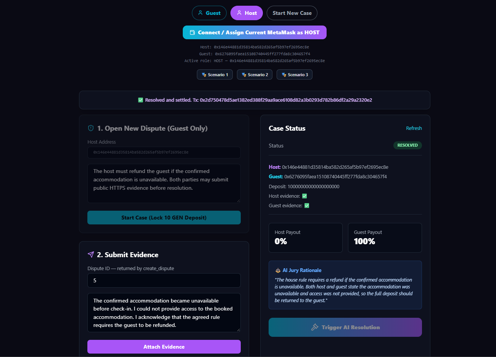

# NomadCourt — Final Steward Resubmission Evidence

## Production contract remains unchanged

- StudioNet address: `0x9C1eB73167FAfECeAd0FD046e0b54020D34250a7`
- `contracts/NomadCourt.py` SHA-256: `2ff3df46997146288ff918116b57e7ebf7a98777890978063807112b5aede2b5`
- No production redeployment is required for this steward response.

## Fresh executable runtime proof

The bundled `STEWARD_NATIVE_PAYOUT_RUNTIME.json` was generated by a successful `npm run test:steward` run on GenLayer StudioNet.

Runtime artifact SHA-256:

`f678f915af2242bd70df796567d69d0581b123b510a644b42f509eaa737abfbb`

The artifact source-locks the exact files used in that run:

- production contract: `2ff3df46997146288ff918116b57e7ebf7a98777890978063807112b5aede2b5`
- test-only payout probe: `7c48f7fa600a166435d0c662bf553daacf2de2d6ac59f212ae296b672f10fcd9`
- runtime test script: `1d0ea8f2468fb559e41bbea4dfa63ed0f2a7416eb85b56ceae2020774b893693`

Final console banner from the fresh run:

```text
STEWARD NATIVE PAYOUT STATIC CHECK PASSED
NATIVE PAYOUT + ATOMIC ROLLBACK TEST PASSED
```

## What the runtime run proves

### Native payout success

The successful parent transaction:

- emitted exactly 2 parent messages;
- created exactly 2 triggered child transactions;
- increased Host balance by exactly `1000000000000000` wei;
- increased Guest balance by exactly `1000000000000000` wei;
- drained the test-only probe balance to `0`.

This is executable evidence that both native transfers committed.

### Atomic rollback

The same probe was re-funded with `2000000000000000` wei and the rollback-only path was executed. The static gate proves that path calls `_emit_split(host, guest)`, emits both native transfers, and then immediately raises `gl.vm.UserError`.

The finalized rollback parent then showed:

- exactly 2 emitted parent messages;
- 0 committed triggered child transactions;
- Host delta `0`;
- Guest delta `0`;
- probe delta `0`;
- full `2000000000000000` wei retained by the probe.

This controlled pair demonstrates atomic discard of both emitted native transfers.

## StudioNet execution-enum scope

On the observed StudioNet / `genlayer-js@1.1.8` decoder path, `txExecutionResultName` and `txExecutionResult` were not published. The runtime proof does not infer success or revert from those missing fields and does not fall back to raw leader receipts, validator internals, `gen_getTransactionReceipt`, or unavailable debug RPCs.

If a compatible path publishes the documented execution enum, the runtime harness checks it only as corroboration.

Wallet/signing/RPC submission failures, receipt/RPC failures, and triggered-transaction read failures are explicit test failures and are never accepted as proof of a contract revert.

## What the previous resubmission got wrong

The previous submission claimed this requirement as PASS on the strength of
`scripts/test_flow.js` alone. `src/App.tsx` still derived the id by recursively
scanning the finalized receipt and, failing that, the transaction, returning the
first string of digits it reached. The steward was right to reject it. That path
is deleted.

An intermediate fix attempted `gen_dbg_traceTransaction`, but the hosted
StudioNet endpoint does not expose that debug method. The production fix now
waits for `FINALIZED` and decodes exactly
`consensus_data.leader_receipt[0].result.payload.readable`. This is the same
accepted-leader result that the official GenLayer Explorer decodes for its
`Return Value` display. The decoder requires `result.status === "return"`, then
requires a canonical positive decimal string; missing or malformed data is a
hard error. There is no recursive search, alias probing, guessed latest id, or
debug-RPC dependency. `npm run test:id-source` locks these invariants and runs
positive and negative cases directly from `src/App.tsx`.

Live StudioNet verification:

- Transaction: `0xc12e44054dab716282b68c6d78a8c14b98a8a7e12038922775af7c1af5625a58`
- Status: `FINALIZED`, GenVM execution: `SUCCESS`
- Exact Explorer Return Value: `"5"`
- Explorer URL: `https://explorer-studio.genlayer.com/tx/0xc12e44054dab716282b68c6d78a8c14b98a8a7e12038922775af7c1af5625a58`

### Completed lifecycle for returned Case ID 5

The same returned Case ID was completed through the production interface on
StudioNet with two distinct wallets:

- Host: `0x146e44881d35814ba582d265af5b97ef2695ec8e`
- Guest: `0x6276095faea15108740445ff277fda8c304657f4`
- Host evidence: present
- Guest evidence: present
- Final status: `RESOLVED`
- Host payout: `0%`
- Guest payout: `100%`
- Resolution transaction: `0x2d750478d5ae1382ed388f29aa9ace6108d82a3b0293d782b86df2a29a2320e2`
- Explorer URL: `https://explorer-studio.genlayer.com/tx/0x2d750478d5ae1382ed388f29aa9ace6108d82a3b0293d782b86df2a29a2320e2`

The screenshot below records the resolved contract state, both evidence flags,
the returned Case ID, the payout split, and the AI jury rationale.



Screenshot SHA-256:

`ae25b1a7d5b71a347caa71558c343dae98cbeb6295da42156e996233f151f077`

## Steward requirement matrix

| Requirement | Result | Evidence |
|---|---|---|
| Native payout primitive runtime-verifiable in repo | PASS | Source-locked probe uses exact production `NativePayout` interface; live deploy/fund/payout succeeds |
| Executable test proves both native transfers | PASS | 2 emitted messages, 2 triggered children, exact Host/Guest balance gains, probe drained |
| Executable test proves atomic rollback | PASS | Same funded probe: 2 emissions, 0 committed children, zero recipient movement, full probe balance retained, source-locked raise-after-emission path |
| Only documented/defensible return or execution evidence decoded | PASS | Both app and test decode exactly `consensus_data.leader_receipt[0].result.payload.readable`, after requiring `status === "return"`. This is the same accepted-leader field used by the official Explorer. Recursive `findReturnedString`, transaction rescans, alias probing, guessed IDs, and debug-RPC dependence are absent. Test: `scripts/test_flow.js::decodeDisputeIdFromLeaderReceipt`. App: `src/App.tsx::decodeDisputeIdFromLeaderReceipt`. |
| Contract-level rollback separated from wallet/signing/RPC failures | PASS | Pre-chain/RPC failures are hard FAILs and cannot satisfy finalized rollback-state assertions |

## Reviewer commands

```bash
npm install --no-audit --no-fund
npm run test:id-source
npm run test:payout:static
```

For a fresh live rerun, set three dedicated StudioNet test keys locally and run:

```bash
npm run test:steward
```

Private keys are never included in the repository or runtime artifact.
